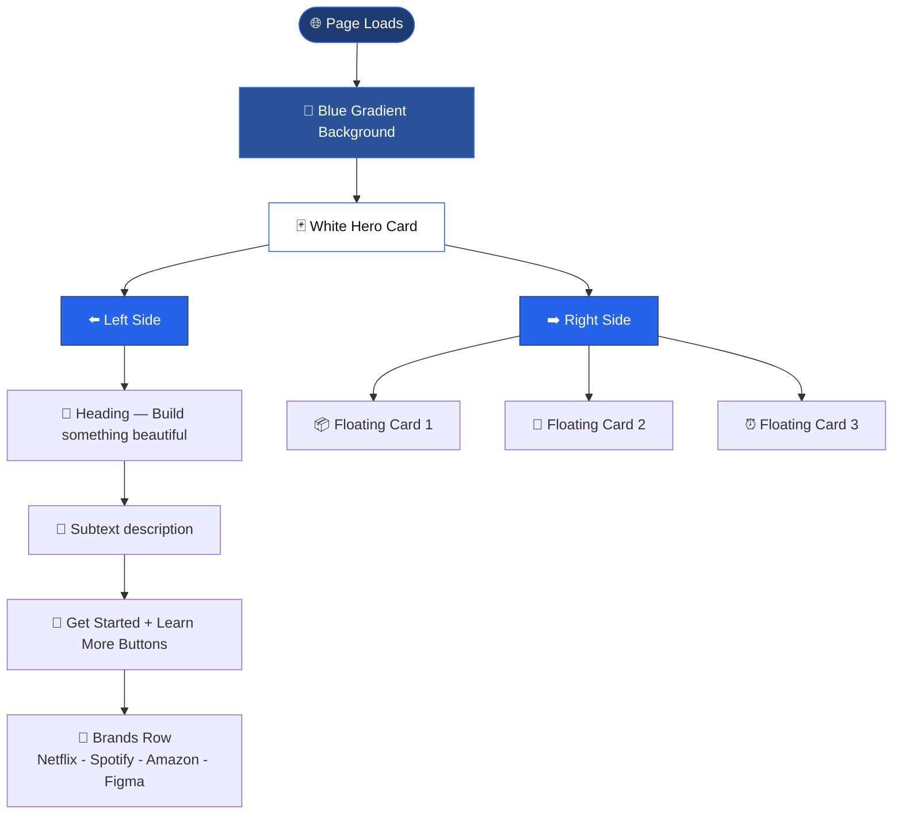

# 🚀 Hero Section — HTML & CSS

> *Build something beautiful.* — A modern hero section built with HTML & CSS.


---

## ✨ Features

- 🎨 Blue gradient full page background
- 🃏 White card hero layout
- 💙 Animated floating cards (float animation)
- 🔵 Primary & Secondary buttons
- 🏢 Brand logos row — Netflix, Spotify, Amazon, Figma

---

## 📁 Folder Structure
```
📁 hero-section/
   ├── 📄 index.html
   └── 🎨 style2.css
```

---

## 🔄 Page Flow


---

## 🎨 Design Details

| Feature | Detail |
|---------|--------|
| Background | Dark blue gradient `#1e3c72 → #2a5298` |
| Hero Card | White with rounded corners + shadow |
| Accent Color | Blue `#2563eb` |
| Animation | Cards float up and down infinitely |
| Font | Segoe UI |

---

## ▶️ How to Run
```bash
1. Download both files
2. Keep index.html and style2.css in same folder
3. Open index.html in browser
```

---

> *Built with HTML & CSS only — no frameworks* 💪
